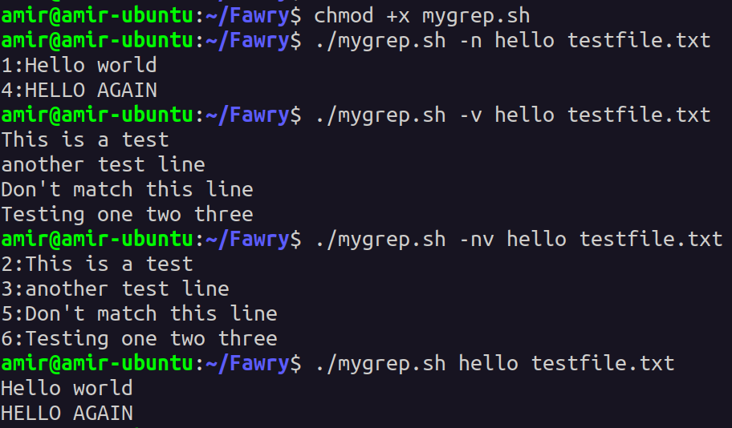
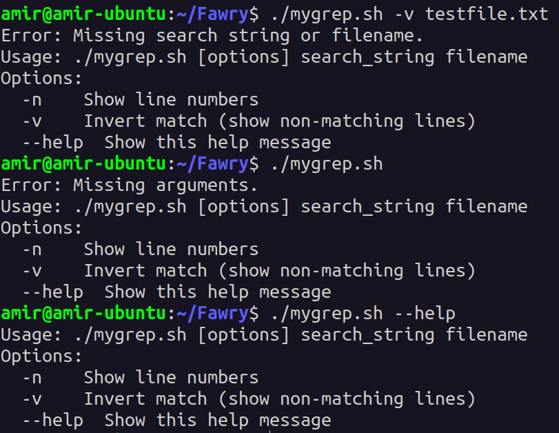
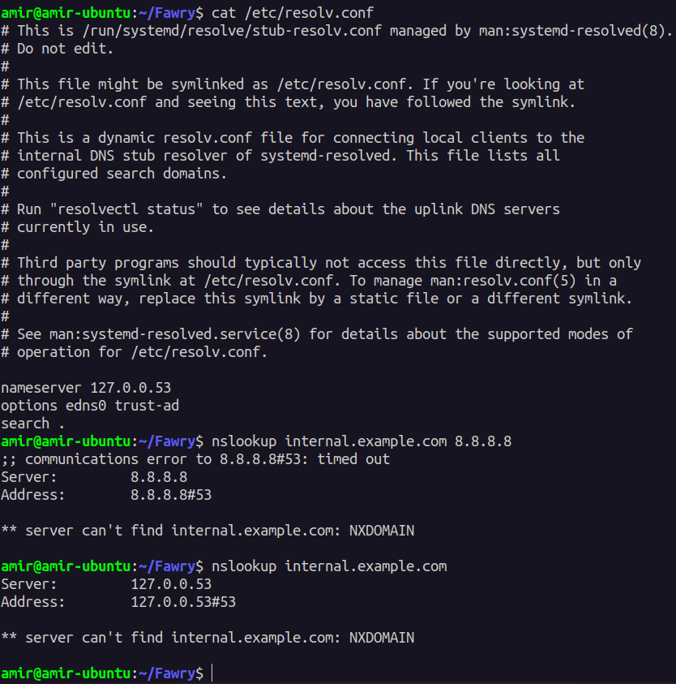
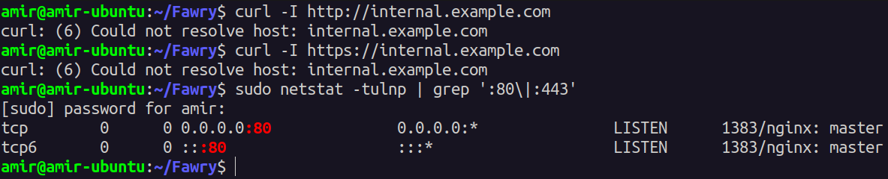

---
# Tasks
---

## **Q1 : Custom Command (mygrep.sh)**
---

### **Validation Screenshots**




---

# ✨ Reflective Section

### 1. Breakdown of how the script handles arguments and options:
- **Argument Handling**: 
  - Expects two arguments: a search string and a filename.
  - Displays an error message and shows usage if arguments are missing.
  
- **Options Parsing**: 
  - Supports `-n` (to show line numbers) and `-v` (to invert the match).
  - Uses `getopts` to process options and set flags (`show_line_numbers` and `invert_match`).
  
- **Search String and Filename**: 
  - After processing options, `shift $((OPTIND -1))` removes options from the arguments.
  - Assigns remaining arguments as the search string and filename.

---

### 2. If you were to support regex or -i/-c/-l options, how would your structure change?
- **Regex Support**: 
  - Replace `sed` with `grep` for regex matching.
  - Ensure search string is sanitized to avoid issues with special characters.
- **-i (Case-insensitive)**: 
  - Add `-i` option to perform case-insensitive search.
  - Modify the search command (`grep` or `sed`) to include the `-i` flag.
- **-c (Count matches)**: 
  - Add `-c` option to count the matches.
  - Increment a counter and print the total number of matches at the end.
- **-l (Print only filenames)**: 
  - Add `-l` option to print the filename if any match is found.
  - Avoid printing matching lines, only the filename is shown.

---

### 3. What part of the script was hardest to implement and why?
- **Invert Match (`-v`)**: 
  - Handling the combination of options like `-vn`, `-nv` together while keeping track of argument shifting (`shift $((OPTIND-1))`) correctly was tricky.
  - Handling boolean flags and ensuring correct output when `-v` was used, especially with `-n`, added complexity.

---
---

## Task 2: DNS/Network Troubleshooting

### Situation:
Internal service `internal.example.com` is unreachable. Users get “host not found” errors.

---

###  Steps Taken:

#### 1. Verify DNS Resolution:

- Check current DNS configuration:
```bash
cat /etc/resolv.conf
nslookup internal.example.com
```

- Test with public DNS (8.8.8.8):
```bash
nslookup internal.example.com 8.8.8.8
```

---

### 🖼️ Screenshot:



---

#### 2. Diagnose Service Reachability:

- Test if the service is reachable via HTTP/HTTPS:
```bash
curl -I http://internal.example.com
curl -I https://internal.example.com

```


- Check if the service is listening on the server:
```bash
sudo netstat -tulnp | grep ':80\|:443'
```


---

#### 3. Possible Causes and Fixes:

**Possible Causes:**

- **DNS Issues:**
  - Wrong DNS server
  - Missing or incorrect A record
  - Local DNS caching issues

- **Network Issues:**
  - Firewall blocking required ports
  - Routing problems or subnet blocking

- **Service Issues:**
  - Service not listening on correct IP or port
  - Service crashed or misconfigured

- **System Configuration Issues:**
  - Incorrect `/etc/hosts` entries
  - Local DNS resolver misbehaving

---

**How to Confirm and Fix:**

- **DNS Issue:**
  - Confirm with `dig`, `nslookup`
  - Fix by editing `/etc/resolv.conf` or DNS server settings

- **Network Issue:**
  - Confirm with `telnet`, `nc`
  - Fix by allowing ports using firewall rules, e.g., `sudo ufw allow 80,443`

- **Service Issue:**
  - Confirm with `netstat`, `ss`
  - Fix by restarting the service, checking configs

- **System Configuration Issue:**
  - Confirm by checking `/etc/hosts`, and flushing DNS cache
  - Fix `/etc/hosts` or restart `systemd-resolved`

---

#### 🛠️ Commands for Fixing:

- Edit `/etc/resolv.conf`:
```bash
sudo nano /etc/resolv.conf
```

- Add manual entry to `/etc/hosts`:
```bash
sudo nano /etc/hosts
# Example:
192.168.1.10 internal.example.com
```

- Open firewall ports:
```bash
sudo ufw allow 80
sudo ufw allow 443
sudo ufw reload
```

- Restart services:
```bash
sudo systemctl restart nginx
# or
sudo systemctl restart apache2
```

- Persist DNS settings using `systemd-resolved`:
```bash
sudo nano /etc/systemd/resolved.conf
# Set DNS=8.8.8.8
sudo systemctl restart systemd-resolved
```

Or with NetworkManager:
```bash
nmcli connection modify <connection_name> ipv4.dns "8.8.8.8 1.1.1.1"
nmcli connection up <connection_name>
```

---


